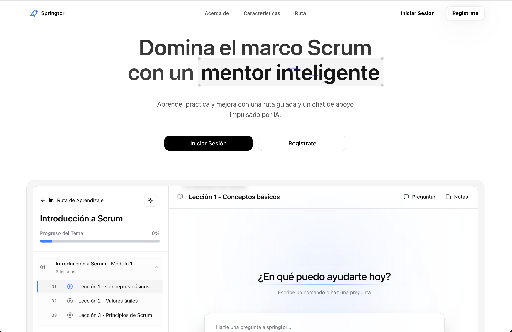
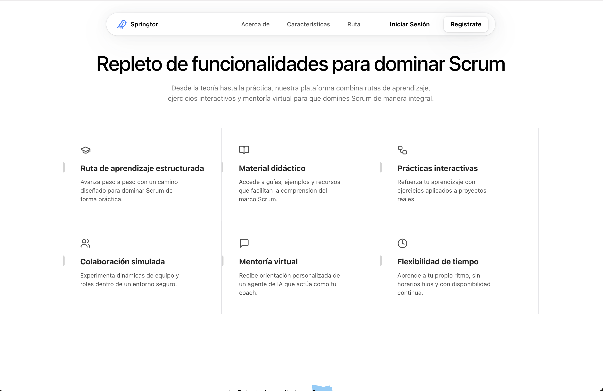
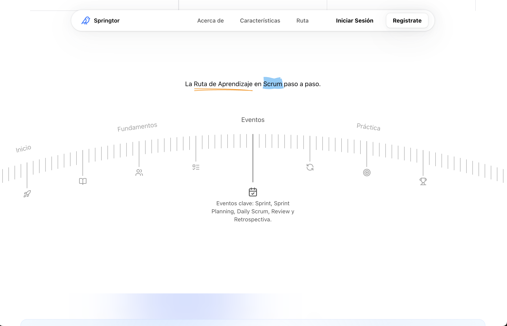
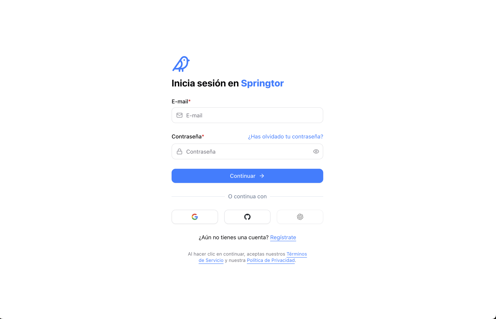
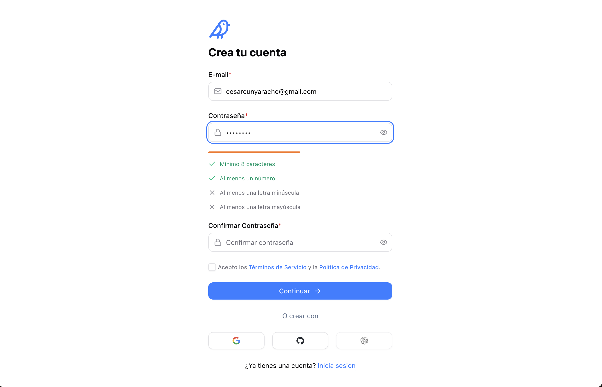
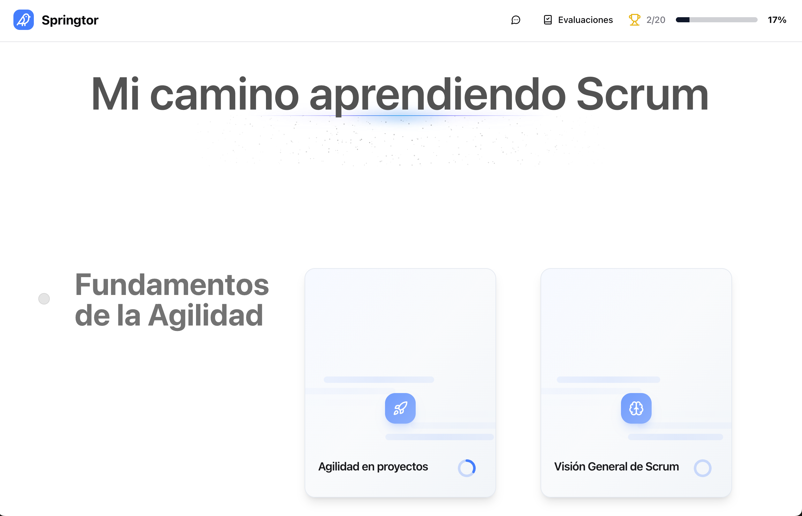
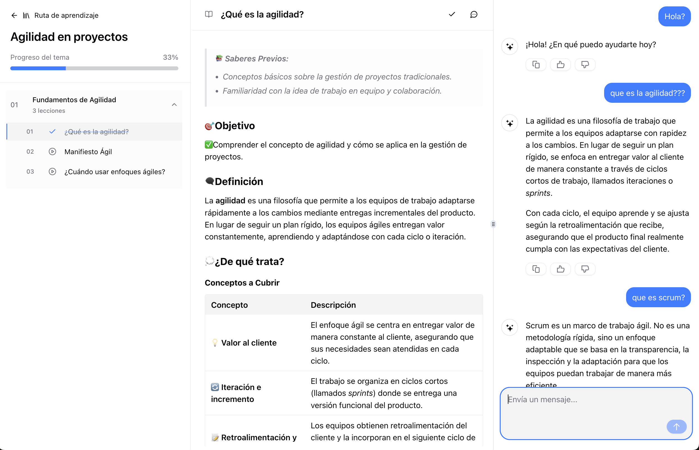
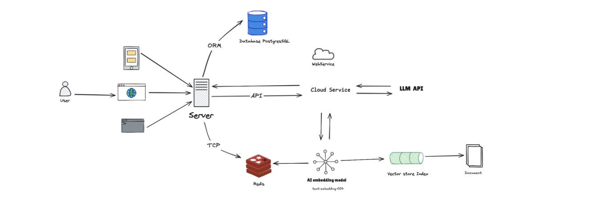

# Springtor



**Springtor es un mentor inteligente para aprender Scrum.** Combina una ruta de aprendizaje guiada, evaluaciones teóricas y prácticas, y un tutor conversacional construido con **RAG (Retrieval-Augmented Generation)**, que responde a partir de una base de conocimiento curada de Scrum y no de lo que "recuerda" el modelo.

> **¿Por qué "Springtor"?** Viene de **Spring**, por el _Sprint_ de Scrum, y **tor**, por _Mentor_. Es un mentor que te acompaña sprint a sprint.

Lo construí hace un año, cuando RAG aún era una técnica emergente y casi ninguna plataforma educativa lo usaba para anclar un tutor de IA a su propio contenido.

---

## El producto

|                                                                                                                 |                                                                                              |
| --------------------------------------------------------------------------------------------------------------- | -------------------------------------------------------------------------------------------- |
|                                                                            |                                                     |
| **Funcionalidades**: ruta estructurada, material didáctico, prácticas, colaboración simulada y mentoría con IA. | **Ruta paso a paso**: Inicio → Fundamentos → Eventos → Práctica.                             |
|                                                                           |                                                                |
| **Autenticación** con credenciales, Google y GitHub.                                                            | **Registro** con validación de contraseña en tiempo real.                                    |
|                                                                                  |                                                       |
| **Panel de progreso**: temas, avance global y evaluaciones.                                                     | **Lección + tutor RAG**: el chat conoce la lección abierta y responde con ejemplos de Scrum. |

### Qué puede hacer el estudiante

- **Seguir una ruta de aprendizaje** (Roadmap → Topics → Modules → Lessons) y ver su progreso por tema y en total.
- **Preguntarle al tutor** dentro de cada lección. La respuesta combina el contenido de la lección con fragmentos recuperados de la base vectorial.
- **Rendir evaluaciones pre-test y post-test**, teóricas y prácticas, para medir cuánto aprendió.
- **Hacer una evaluación práctica simulada de un Sprint**: Product Backlog, historias de usuario, Planning Poker, Sprint Goal, Sprint Backlog, impedimentos, Review y Retrospectiva.
- **Rendir exámenes con proctoring**: detección de rostro por webcam (MediaPipe), pantalla completa obligatoria, detección de cambio de pestaña y bloqueo de copiar, selección y menú contextual.
- **Tomar notas** en un editor enriquecido (Plate) con asistencia de IA, **generar quizzes** desde un PDF y trabajar con **Artifacts** (texto, código, hojas de cálculo e imágenes) junto al chat.

---

## Cómo funciona el RAG

El tutor no responde "de memoria". Cada mensaje pasa por esta secuencia:

1. **Embedding de la pregunta** con `text-embedding-004` de Google.
2. **Búsqueda semántica** en un índice de **Pinecone** (top-K = 3, umbral de similitud mínimo) sobre la base de conocimiento de Scrum.
3. **Construcción del contexto**: se unen los fragmentos relevantes (máx. ~3000 caracteres) y se inyectan junto con el **contexto de la lección** que el estudiante tiene abierta.
4. **Generación con restricciones**: Gemini responde siguiendo un _knowledge prompt_ estricto. Solo usa el contexto, prioriza la lección, reformula en vez de copiar, ilustra con casos prácticos y, si no hay información, responde _"Lo siento, no lo sé."_
5. **Streaming** de la respuesta palabra a palabra, con persistencia del chat en PostgreSQL.

La ingesta (`api/crawl`) recorre las fuentes, las divide en _chunks_ (recursivo o Markdown), genera los embeddings, los deduplica con un hash MD5 como ID y los sube a Pinecone por lotes (`chunkedUpsert`).

---

## Arquitectura



| Capa          | Responsabilidad                                                                                          | Tecnología                                                           |
| ------------- | -------------------------------------------------------------------------------------------------------- | -------------------------------------------------------------------- |
| **Cliente**   | UI web y responsive, chat en streaming, editor, proctoring                                               | Next.js 15 (App Router), React 19, Tailwind 4, Radix/shadcn, Zustand |
| **Servidor**  | Route handlers, server actions, middleware de sesión, rate limit por usuario                             | Next.js, Auth.js v5 (JWT + OAuth)                                    |
| **Datos**     | Usuarios, chats, mensajes, votos, documentos, ruta de aprendizaje, progreso y respuestas de evaluaciones | PostgreSQL + Drizzle ORM                                             |
| **Streams**   | Streams reanudables: si el usuario recarga, la respuesta continúa donde iba                              | Redis + `resumable-stream`                                           |
| **IA / LLM**  | Enrutamiento de modelos por tarea                                                                        | Vercel AI SDK + Google Gemini                                        |
| **Retrieval** | Embeddings y búsqueda vectorial                                                                          | `text-embedding-004` + Pinecone                                      |
| **Archivos**  | Subida de adjuntos y medios                                                                              | Vercel Blob, UploadThing                                             |

### Detalles de diseño

- **Un modelo por tarea**: `gemini-2.5-flash` para el chat, `gemini-2.0-flash-lite` con _reasoning middleware_ para razonamiento y artifacts, y `gemini-2.5-flash-lite` para generar títulos. Se configura en [`src/lib/ai/providers.ts`](src/lib/ai/providers.ts).
- **Doble contexto**: el prompt de sistema combina el contexto de la lección con el contexto recuperado, así el tutor responde a la clase que el estudiante está viendo.
- **Grounding estricto**: se prefiere un "no lo sé" antes que una alucinación. Es un tutor limitado deliberadamente a Scrum.
- **Tool calling**: el modelo puede crear o actualizar documentos y proponer sugerencias (`createDocument`, `updateDocument`, `requestSuggestions`).
- **Medición del aprendizaje**: pre-test y post-test (teóricos y prácticos) se guardan por separado para comparar el antes y el después.
- **Testing**: E2E con Playwright y modelos simulados para correr el chat sin llamar a la API real.

---

## Estructura

```
src/
├── app/
│   ├── (auth)/            # sign-in, sign-up, Auth.js
│   ├── (before)/          # onboarding + evaluación teórica pre/post test
│   ├── (app)/
│   │   ├── scrum/         # roadmap, lecciones, chat, evaluación práctica (proctoring)
│   │   ├── api/           # chat (RAG), context, crawl, document, history, vote...
│   │   └── notes, quizz, calendar, panel
│   └── api/               # generate-quiz, copilot, uploadthing
├── lib/
│   ├── ai/                # providers, prompts, tools
│   └── db/                # schema, queries, migraciones, seed (Drizzle)
├── utils/                 # embeddings, pinecone, context, chunkedUpsert  ← núcleo RAG
├── artifacts/             # text, code, sheet, image
└── components/            # UI, chat, editor, calendar
```

---

## Ejecución local

**Requisitos:** Node 20+, PostgreSQL, Redis (opcional, para streams reanudables) y cuentas de Google AI Studio y Pinecone.

```bash
git clone <repo> && cd agent-ai
npm install
cp .env.example .env      # completa las variables
npm run drizzle:seed      # carga roadmap, temas y lecciones
npm run dev               # http://localhost:3000
```

Variables principales en `.env`:

| Variable                                                                  | Uso                         |
| ------------------------------------------------------------------------- | --------------------------- |
| `AUTH_SECRET`                                                             | Firma de sesiones (Auth.js) |
| `POSTGRES_URL`                                                            | Base de datos               |
| `GOOGLE_GENERATIVE_AI_API_KEY`                                            | Gemini + embeddings         |
| `PINECONE_API_KEY`, `PINECONE_INDEX`, `PINECONE_CLOUD`, `PINECONE_REGION` | Base vectorial              |
| `REDIS_URL`                                                               | Streams reanudables         |
| `BLOB_READ_WRITE_TOKEN`                                                   | Subida de archivos          |
| `AUTH_GOOGLE_*`, `AUTH_GITHUB_*`                                          | OAuth                       |

---
